#### **Understanding Microsoft PowerBI**
### **INTRODUCTION**
- PowerBI is a 'Business Intelligence' tool that provides insights into organisational data.
- It allows users to create interactive reports,dashboards and visualizations.For better understanding,navigating and playing around the PowerBI Desktop to learn the basics of PowerBI in other to solve the problem below is what this task entails. 
### **Problem Statement**
- In this task, we will see how to create
- "Table" in PowerBI
- How to import data(table) from "Web" to PowerBI
- How to import Data from "FILES" to PowerBI and
- How to connect "MySQL database" to PowerBI.
### Result/Discussion:
## The first task is to create a 'Table' of four(4) Columns and five(5) Rows of information.
- To create a Table in PowerBI,Click on the home menu and under the Home menu,click on "Enter Data" option,
- 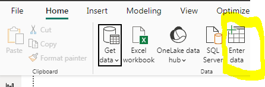
- When clicked on the Enter Data option,this page below pops up,the Table can be named by double clicking on the table colunm as seen in the snipshot to enter your desired Table name,the column name can also be named by double clicking on the column box to enter your desired column name and the + sign is used to select as many Columns as possible same also as many Rows as possible.
- 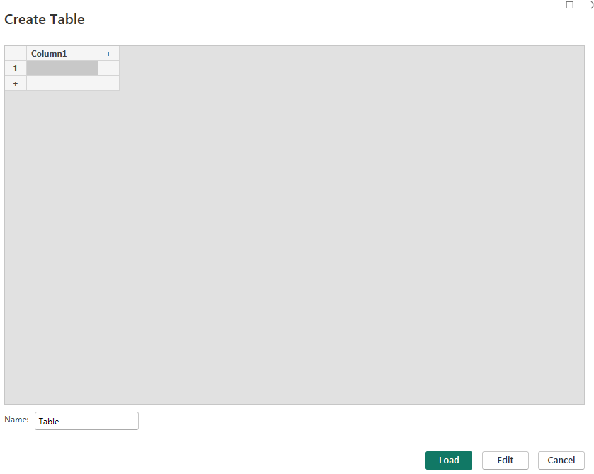
- 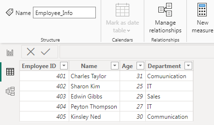
- The snipshot above shows a Table created named Employee_Info with four(4) Columns and five(5) Rows of information.
- 

## How to import data(table) from "Web" to PowerBI
- To import a table from Web into PowerBI,Click on the "Get Data" Icon and scroll down and click on the web option
- 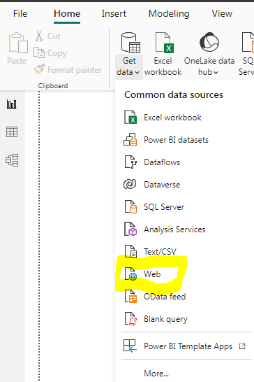
- Once clicked on the web option,this page below pops up requesting the "URL" of the web importing the data(table) from, to be entered.when entered,click on 'OK'
- 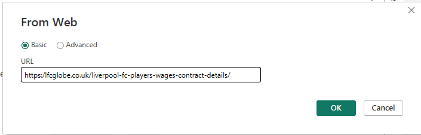
- The snipshot below shows the imported table from the "Web"
- 

## How to import Data from "Files to PowerBI
- To import data from files,Click on the "Get Date" Icon and scroll down and click on the Text/CSV option.
- 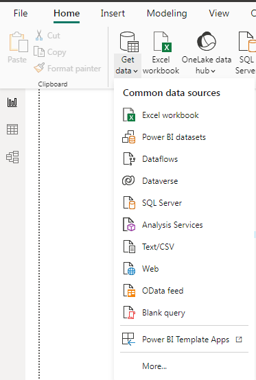
- once clicked on the Text/CSV option, it directs to the system's file manager,then select the file you want to import from and click on "Open".
- 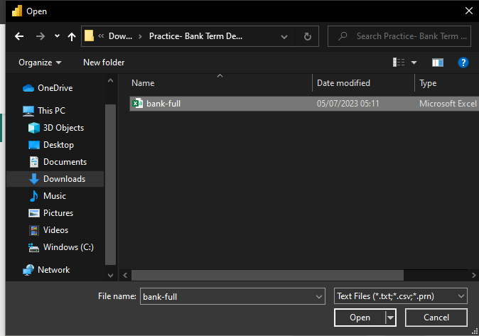
- The snipshot below shows the data from the selected file and for it to be loaded into PowerBI,Click on "Load" but if the Data is messy and requires to be cleaned,click on "Transform"
- 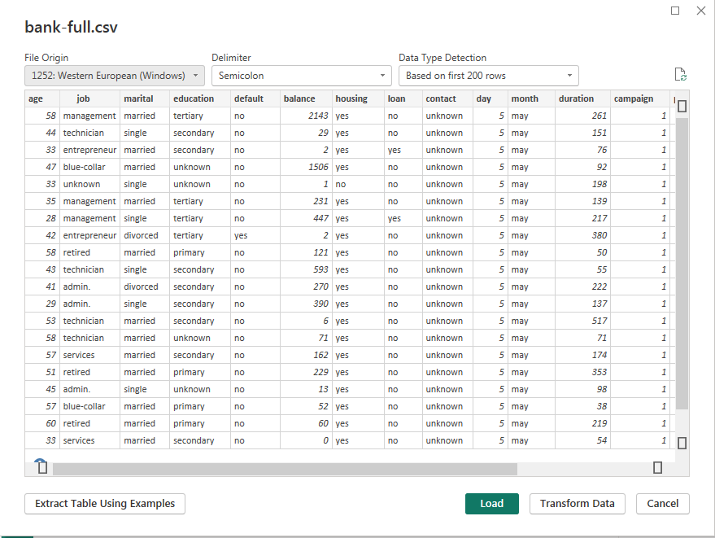
- The snipshot below show the DATA being tranformed in the "power query editor"
- 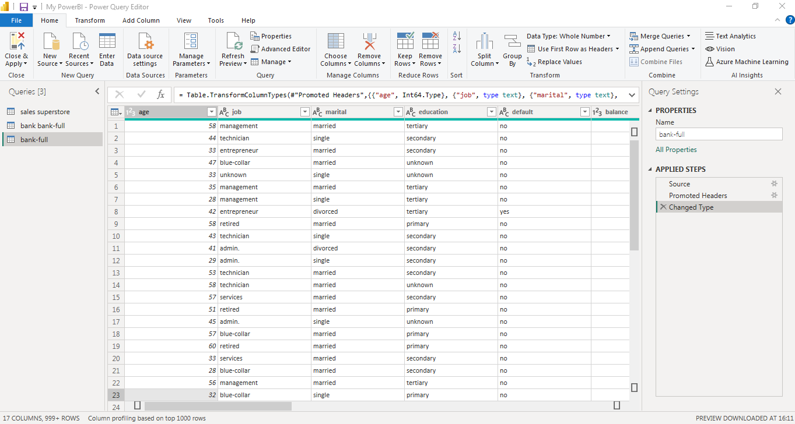

## How to Connect MySQL Database to PowerBI
- To connect MySQL database to PowerBI,Click on "Get Data" icon under Home menu option,scroll down and click on more,then in search bar,type mysql database and select it,then click on "Connect"
- 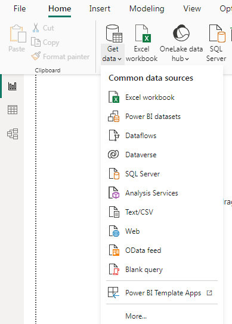
-  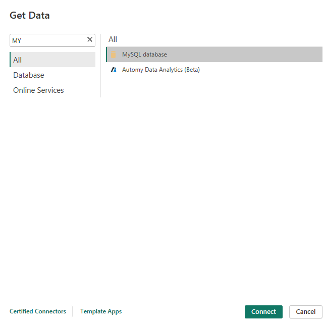
-  Once clicked on Connect,this page pops up requesting that your server and the database name be entered
-   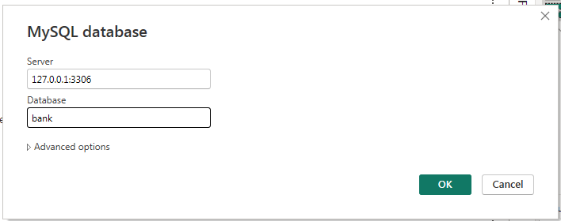
-   Once entered, a page pops up requesting that your username and password be entered and then click on OK
-   The snipshot below shows the database from MYSQL,to import it,click on load or Transform if the Data is messy and needs to be cleaned
-    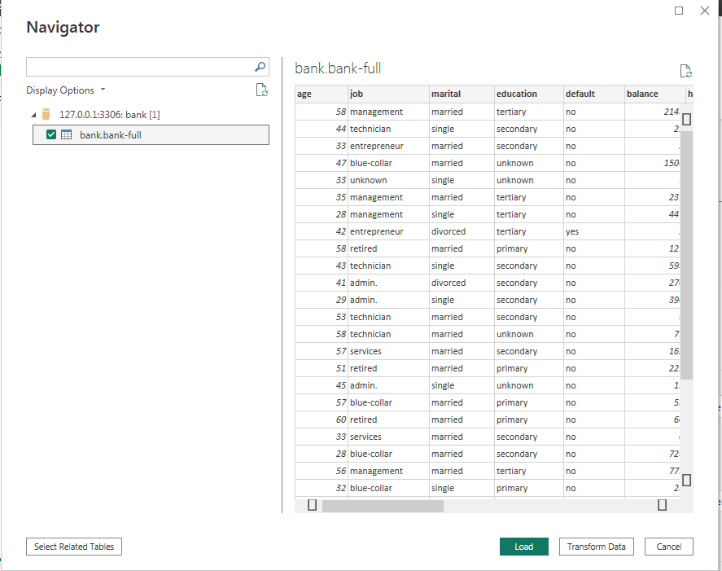
-    ---
## **Conclusion**
From the above steps,it was possible to successfully Create a Table in PowerBI,Import Data from Web to PowerBI,Import Data from files to PowerBI and Connect MYSQL Database to PowerBI.
